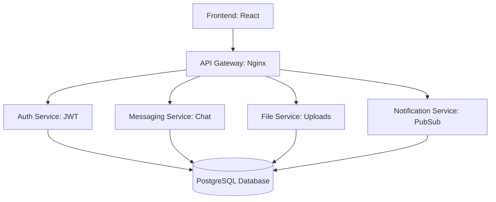

# CollabMicro
*A microservices-based collaboration platform with chat, file sharing, and notifications.*

---

## 📌 Overview
CollabMicro is a distributed collaboration platform built with **microservices**.  
It demonstrates modern software architecture practices including service separation, containerization, and real-time communication.

**Core Features (planned):**
- 🔑 Authentication & User Management  
- 💬 Real-time Messaging  
- 📁 File Upload & Sharing  
- 🔔 Notifications System  
- 🌐 Frontend Web UI  

---

## 🛠 Tech Stack
- **Backend:** .NET / Node.js (microservices architecture)  
- **Frontend:** React 
- **Database:** PostgreSQL  
- **Containers:** Docker & Docker Compose  
- **Messaging/Events:** RabbitMQ
- **Gateway:** Nginx Reverse Proxy  

---

## 📐 Architecture


🚀 Getting Started
1. Clone the Repo
```bash
git clone https://github.com/CHHerndon/CollabMicro.git
cd CollabMicro
```
2. Start Infrastructure (DB + Admin Tool)
Create docker-compose.yml with Postgres + pgAdmin:

```yaml
Copy code
version: '3.8'
services:
  postgres:
    image: postgres:15
    container_name: collab_postgres
    environment:
      POSTGRES_USER: collab
      POSTGRES_PASSWORD: collab123
      POSTGRES_DB: collabdb
    ports:
      - "5432:5432"
    volumes:
      - postgres_data:/var/lib/postgresql/data

  pgadmin:
    image: dpage/pgadmin4
    container_name: collab_pgadmin
    environment:
      PGADMIN_DEFAULT_EMAIL: admin@local.com
      PGADMIN_DEFAULT_PASSWORD: admin
    ports:
      - "5050:80"

volumes:
  postgres_data:
```
Run:

```bash
docker-compose up -d
```
Access **pgAdmin** at [http://localhost:5050](http://localhost:5050) with:

- **Email:** `admin@local.com`  
- **Password:** `admin`  

Connect to the **Postgres service** using:

- **Host:** `postgres`  
- **User:** `collab`  
- **Password:** `collab123`  
- **Database:** `collabdb`  

---

## 🗺 Roadmap

- [ ] Authentication Service  
- [ ] Messaging Service  
- [ ] File Service  
- [ ] Notifications Service  
- [ ] Frontend UI  
- [ ] API Gateway & Deployment  

📄 License
MIT License
